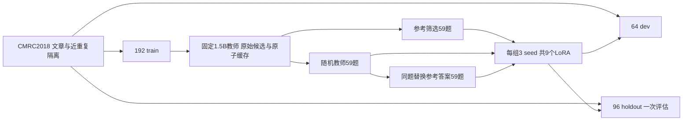

# 中文数据质量实验：结果、证据与限制

2026-09-20新增实验。**预登记的同题参考目标替换，在一次96题同来源留出评估上得到正向严格EM差值；自动核验器仍未通过筛查。** 不据此宣称无需标注蒸馏、生产可用或外部领域泛化。

## 输入、处理与产物

公开包保留训练目标、逐条步骤、输入/监督token、原始预测、评分、协议和哈希。模型/适配器权重未上传；本地保存后重载9个适配器，18条输出token IDs、文本、停止原因一致。此检查不等于异机训练复现。

## 最终留出结果

协议在首次留出推理前冻结；未改参数、未挑选seed，全部模型、全部96题都纳入。字符LCS F1是自定义中文指标，不是CMRC官方成绩。

| 固定模型/组 | 三seed严格正确数（各96题） | 平均严格EM | 平均字符LCS F1 |
|---|---|---:|---:|
| 未训练0.5B基线 |18（单一基线）|18.75%|56.88%|
| 参考筛选教师输出 |22 /22 /21|22.57%|60.39%|
| 随机教师输出 |16 /16 /18|17.36%|59.45%|
| 同题替换参考答案 |24 /21 /25|24.31%|62.54%|

主要比较：同题替换参考答案 − 随机教师输出，严格EM差 **+6.94个百分点**，按文章配对bootstrap 95%区间 **[+1.04,+13.54]个百分点**，通过预设研究证据门槛。F1差+3.10个百分点，区间[-1.16,+7.37]，跨零。二者不能混称为所有质量指标均有可靠改善。

次要比较：参考筛选 − 随机教师的EM差+5.21个百分点，区间[+1.04,+10.42]；同题参考目标 − 基线的EM差+5.56个百分点，区间[+0.69,+10.76]。这些为描述性次要结果，没有多重比较校正。参考筛选还改变了题目难度和覆盖，不能解释成纯答案质量效应。

区间以固定三个seed的每题平均差为单位，重采样96篇文章10,000次，条件于当前训练子集和seed。并未估计重新抽训练集的波动。所有题都有答案，未验证拒答能力。该holdout独立于本轮train/dev，但与其来自同一公开CMRC语料；不是外部来源，也不保证预训练未见。**此留出集已消耗，后续修改不能重复将它作为新验证。**

[冻结协议](holdout-08/protocol.json) · [逐模型结果](holdout-08/run/summary.json) · [配对区间](holdout-08/run/paired.json) · [研究门槛决定](holdout-08/run/decision.json)

## 开发集与训练负担

64题dev上，参考筛选、随机教师、同题参考目标的平均EM分别为28.13%、26.56%、33.33%。主要EM差+6.77个百分点，区间[-0.52,+15.10]，跨零；没有把这个开发结果当独立验证。

固定3组×3seed×64更新，576步，batch1、answer-only loss；训练加dev推理405.83秒。三个seed累计监督token分别为1659、1975、2299。虽然同题对照使用相同输入顺序和更新次数，目标替换仍改变长度及监督token数，不能单独分离语义纠正与监督长度机制。最终960条留出预测357.55秒。以上均为同机耗时，不是性能对照或通用速度承诺。

[分组与训练协议](supervised-07/protocol.json) · [分组标签审计](supervised-07/group-audit.json) · [逐条重算](supervised-07/verification.json)

## 未成功的自动核验与更大教师

- 1.5B核验器的三种贪心提示均未过门槛；改为标签似然差并仅在64题校准集选阈值后，新模板验证TPR75%、TNR100%，仍失败。校准集满分不等于可靠泛化。
- 3B固定提示在96条新合成挑战上TPR48/48、TNR37/48；11个错误接受中，8个为例外关系、3个为比较关系。未过门槛。示例：“名单中有甲0号、乙0号。除乙0号外，名单中的人都参加了会议。”问谁没参加，错误候选“甲0号”被接受。
- 3B在相同64题dev、相同48-token输出上限下只答对16题；1.5B答对24题。3B有10条触及输出上限，均计入失败分母。此结果仅限本次配置，不是模型总体能力排序。
- 后续使用参考标签的监督训练，是与自动核验不同的方法；不能把最终正向结果算成失败核验器的成绩。

[1.5B核验决策](score-calibration-04/decision.json) · [3B逐项失败](teacher-3b-06/judge-failures.jsonl) · [3B筛查结果](teacher-3b-06/run/decision.json)

## 工程验证与复现边界

192条教师候选曾在第8条原子落盘后主动退出73；恢复复用8条、生成184条，已有hash不变。再次重放复用192条、生成0条。机制限单生产者的进程中断；计算完成但落盘前崩溃可重复执行，不是任务只执行一次，也未验证断电持久性或多机系统。

公开离线验收重算数据身份、分组、训练步骤、指标、阈值和最终决定；不下载模型、不重新推理，不检查未分发的权重文件。真实两题CPU推理与完整训练分别有独立命令。详见[复现说明](../../docs/QUALITY_STUDY_RELEASE.md)。历史冻结文件保持原样，新阶段记录解释结论差异。

数据与再现内容遵循[CMRC归属](ATTRIBUTION.md)及[SOURCE_LICENSE](SOURCE_LICENSE.txt)；Qwen提供基础模型，PyTorch/Transformers/PEFT提供训练推理。实验设计、实现、执行、验证与文档均使用Codex辅助，不声称独立发明基础算法。
